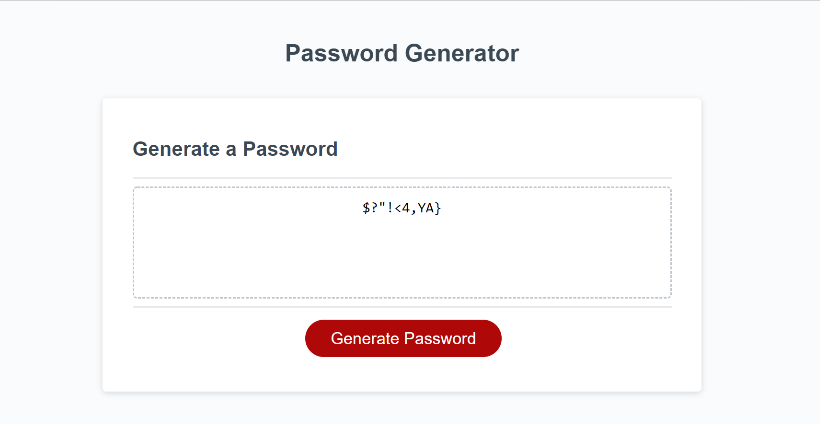
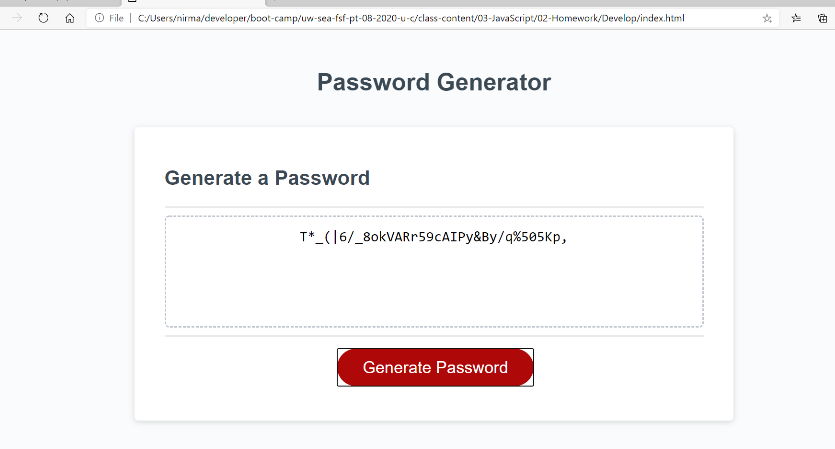

# password-generator-9.22.20

---

## About The Project

---

Implemented the code to generate the password based on user inputs(character type) as below:

-    Lowercase characters
-    Uppercase characters
-    Numeric values
-    Special characters

User must select password length between 8 and 128 and at leaset one type of character out of four to generate random password.
If user select only Lowercase characters,then password will be generated only with the combination of Lowercase characters.
If user select only Uppercase characters,then password will be generated only with the combination of Uppercase characters.
If user select only Special characters,then password will be generated only with the combination of Special characters.
If user select only Numeric values,then password will be generated only with the combination of Numeric values.
If user don't select any character type,will prompt to select at least one type of character.Based on user character type and length the password will be genarated.User can also select four types of characters for password.
If no character type selected,will prompt to try again.

## script.js

-    Assigned lowercase characters,uppercase characters,numeric values and special characters to variables.
-    Assign empty string to charSet variable
-    Based on user character type selection ,characters will be added to charSet variable.
-    Iterate the for loop until reach the length of the password.
-    For each iteration random character will be generated and added to the password variable
-    Finally return the password.

Built With

-    Javascript

## Getting Started

To get a local copy up and running follow below steps.

## Prerequisites

None

## Installation

Clone the repo
git clone git@github.com:NirmalaAbothu/password-generator-9.22.20.git

## Credits

## Followed the documentation of https://www.w3schools.com/js/

## License & copyright

Copyright © 2020 Nirmala Abothu

## Deployed project link

[Password-Generator](https://nirmalaabothu.github.io/password-generator-9.22.20/)
